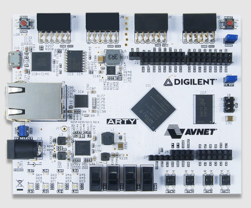
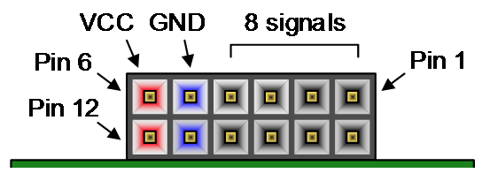
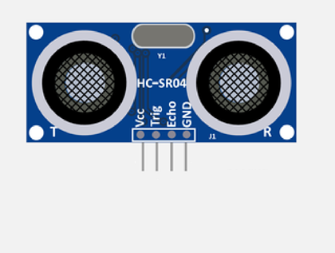
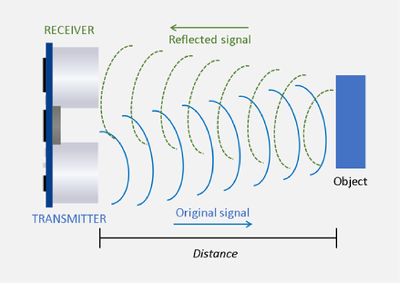
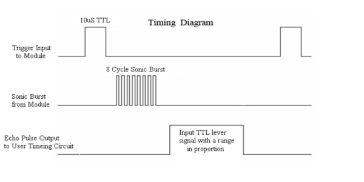
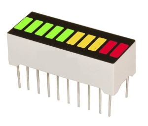
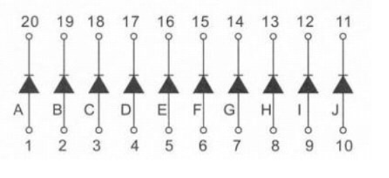
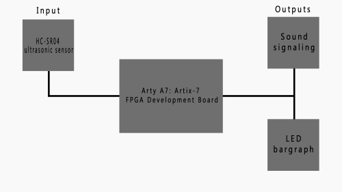
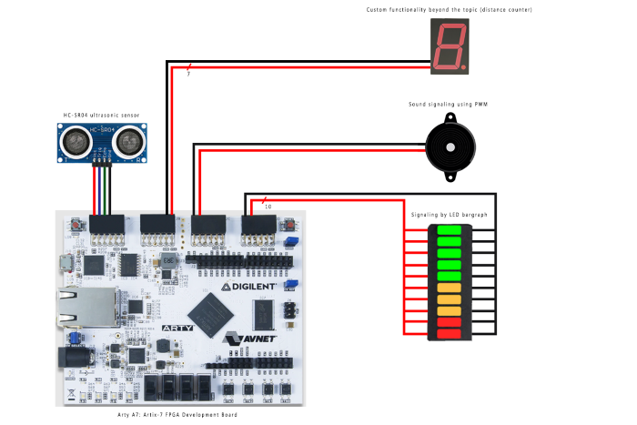

# Parking assistant with HC-SR04 ultrasonic sensor, sound signaling using PWM, signaling by LED bargraph.

## Team members
* Jančošek Matúš
* Jančová Silvie
* Jánoš Vít
* Jarabý Šimon
 
[Link to GitHub project folder ](https://github.com/vitoo420/DE1_projekt)

## Project objectives
Main objective of this projekt was to create funcional parking assistant using an Arty A7: Artix-7 FPGA Development board. To achive this intention we used HC-SR04 ultrasonic sensor as input for measuring the distance between two objekts. We used buzzer and LED bargraph as outputs for signaling measured distance to the user . We had been additionally considering displaying the distance on 7-segment display for more accurate measuring. But more on that later. 

## Hardware description
#### *Hardware used in this project:*
* Arty A7-100T board 
* HC-SR04 ultrasonic sensor
* LED bargraph
* Buzzer
* 4 Digit 7 segment module

### Arty A7: Artix-7 FPGA Development Board
The Arty boards are designed with versatility and flexibility in mind. With universally popular Arduino™ headers and multiple Pmod™ ports, an Arty will be the most adaptable FPGA/SoC board in your toolbox. 

The Arty A7 is a ready-to-use development platform designed around the Xilinx Artix-7 FPGA family. With the Artix-7 devices, the Arty A7 board provides the highest performance-per-watt fabric, transceiver line rates, DSP processing, and AMS integration in the Arty family. With the MicroBlaze Soft Processor Core from Xilinx, you can create embedded applications with a variety of peripherals, memory, and interfaces.

The Arty A7 is supported by Xilinx's Vivado Design Suite, including the free WebPACK version. You can also leverage the Vitis Core Development Kit or Xilinx Software Development Kit to start developing for the MicroBlaze processor with no prior FPGA experience.

There are two variants of the Arty A7: 
* The Arty A7-35T features the XC7A35TICSG324-1L
* The Arty A7-100T features the larger XC7A100TCSG324-1

  

   
  

#### *PinOut of Pmod Connectors on Arty A7-100T board*

  

   
  

  
####  *Pmod Connector table*
  
|  | Pmod JA | Pmod JB | Pmod JC | Pmod JD |
| :-: | :-: | :-: | :-: | :-: |
| Pmod Type | Standard | High-Speed | High-Speed | Standard |
| Pin 1 | G13 | E15 | U12 | D4 |
| Pin 2 | B11 | E16 | V12 | D3 |
| Pin 3 | A11 | D15 | V10 | F4 |
| Pin 4 | D12 | C15 | V11 | F3 |
| Pin 7 | D13 | J17 | U14 | E2 |
| Pin 8 | B18 | J18 | V14 | D2 |
| Pin 9 | A18 | K15 | T13 | H2 |
| Pin 10 | K16 | J15 | U13 | G2 |

### HC-SR04 ultrasonic sensor
#### *Description of HC-SR04 ultrasonic sensor*

 

   
  

First of all we have to understand how the ultrasonic sensors works. Ultrasonic sensors use sound to determine the distance between the sensor and theclosest object in its path. 
Ultrasonic sensors are essentially sound sensors, however they perform at a frequency above human hearing. The sensor sends out a sound wave at a selected frequency (Original signal). 
It then listens for that specificsound wave to bounce off of an object and come back (Reflected signal).

   
  

The sensor maintains track of the time between sending the sound wave and the sound wave returning. 
If you know how fast something is going and how long it is traveling you can find the distancetraveled with equation d=v*t

#### *HC-SR04 Specifications for this project*
This section contains the specifications and why they are important to the sensor module. The sensor modules requirements are as follows. Cost, Weigh, Accuracy of object detection. Cost of modules is most important aspect for every new product. It is basic factor in designing the product. Next one is weight because we want out divice to be  simple, light and over all practical. For that we will also need precision and accuracy. 

#### *HC-SR04 Electric Parameter*
* Working Voltage is DC 5 V
* Working Current is 15mA
* Working Frequency is 40Hz
* Max/Min Range 400cm/2cm
* MeasuringAngle is 15 degree
* Trigger Input Signal 10uS TTL pulse
* Echo Output Signal Input TTL lever signal and the range in proportion
* Dimension of board are 45*20*15mm 

#### *HC-SR04 Timing Chart and Pin Explanations*

The HC-SR04 has four pins VCC, GND, TRIG and ECHO. The VCC and GND pins are the simplest because they power the HC-SR04. These pins need to be attached to a +5 voltedge source and ground respectively. The TRIG pin is responsible for sending the ultrasonic burst. This pin should be set to HIGH for 10 μs, at which point the HC-SR04 will send out an eight cycle sonic burst at 40 kHZ. After a sonic burst has been sent the ECHO pin will go HIGH. The ECHO pin is the data pin it is used in taking distance measurements. After an ultrasonic burst is sent the pin will go HIGH, it will stay high until an ultrasonic burst is detected back, at which point it will go LOW. 

Taking distance measurements with HC-SR04 can be triggered to send out an ultrasonic burst by setting the TRIG pin to HIGH. Once the burst is sent the ECHO pin will automatically go HIGH. This pin will remain HIGH until the the burst hits the sensor again. You can calculate the distance to the object by keeping track of how long the ECHO pin stays HIGH. The time ECHO stays HIGH is the time the burst spent traveling.  Using this measurement in equation 1 along with the speed of sound will yield the distance travelled. A summary of this is listed below, along with a visual representation.

     

To interpret the time reading into a distance you need to change the first equation. The clock on the device you are using will probably count in microseconds or smaller. To useequation 1 the speed of sound needs to determined,which is 343 meters per second atstandard temperature and pressure. To convert this into more useful form use equation 2to change from meters per second to microseconds per centimeter. Then equation 3 canbe used to easily compute the distance in centimeters.

     

### Buzzer

### LED bargraph

     

#### *Internal circuit diagram*

     

[Link to LED bargraph on Amazon ](https://www.amazon.com/Single-Segment-Display-Colors-Arduino/dp/B07BJ8ZGP7#descriptionAndDetails)

## Imagine of block structure design

     

## Imagine of all modules connected to Arty A7: Artix-7 FPGA Development Board

     

## Table with pinouts for used modules

| Pin No.| Pin Name | Description |
| :-: | :-: | :-: |
 | 1 to 10 | Anode | All are anode pins of the respected LED | 
| 11 to 20 | Cathode | All are cathode pins of the respected LED | 

#### Table for HC-SR04 sensor
| Sensor Pin | Board Pin |
| :-: | :-: | 
| VCC | VCC | 
| Trig | D4 | 
| Echo | G13 | 
| GND | GND | 

#### Table for 7 seg 4 digits module 
| Pmod JB | Connection | Cathodes | Pmod JC | Connection | Anodes |
| :-----: | :--------: | :------: | :-----: | :--------: | :----: |
|  Pin 1  |    E15     |    CA    |  Pin 1  |    U12     |  AN0   |
|  Pin 2  |    E16     |    CB    |  Pin 2  |    V12     |  AN1   |
|  Pin 3  |    D15     |    CC    |  Pin 3  |    V10     |  AN2   |
|  Pin 4  |    C15     |    CD    |  Pin 4  |    V11     |  AN3   |
|  Pin 7  |    J17     |    CE    |  Pin 7  |    U14     |   -    |
|  Pin 8  |    J18     |    CF    |  Pin 8  |    V14     |   -    |
|  Pin 9  |    K15     |    CG    |  Pin 9  |    T13     |   -    |
| Pin 10  |    J15     |    DP    | Pin 10  |    U13     |   -    |

## VHDL modules description and simulations

Write your text here.

## TOP module description and simulations

Write your text here.

## Video

*///////*

##  Discussion of results

## References
* https://cdn.sparkfun.com/datasheets/Sensors/Proximity/HCSR04.pdf
* https://datasheetspdf.com/pdf-file/1380136/ETC/HC-SR04/1
* http://www.circuitdb.com/?p=1162
* http://www.micropik.com/PDF/HCSR04.pdf
* http://randomnerdtutorials.com/complete-guide-for-ultrasonic-sensor-hc-sr04/
* http://www.ezdenki.com/ultrasonic.php
* http://www.elecrow.com/hcsr04-ultrasonic-ranging-sensor-p-316.html(^ this one has some cool charts)
* https://components101.com/displays/led-bar-graph
