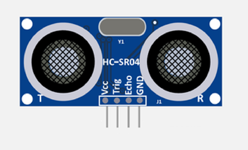
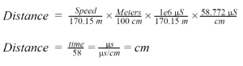
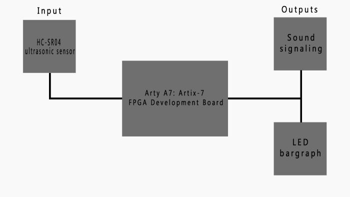

# Parking assistant with HC-SR04 ultrasonic sensor, sound signaling using PWM, signaling by LED bargraph.

## Team members 
* Jančošek Matúš
* Jančová Silvie
* Jánoš Vít
* Jarabý Šimon

[Link to GitHub project folder ](https://github.com/vitoo420/DE1_projekt)

 
## Project objectives
Main objective of this projekt was to create funcional parking assistant using an Arty A7: Artix-7 FPGA Development board. To achive this intention we used HC-SR04 ultrasonic sensor as input for measuring the distance between two objekts. We used buzzer and LED bargraph as outputs for signaling measured distance to the user . We had been additionally considering displaying the distance on 7-segment display for more accurate measuring. But more on that later. 
 
<p align="center" width="100%">
    
 </p>

## Hardware description
#### *Hardware used in this project:*
* Arty A7-100T board 
* HC-SR04 ultrasonic sensor
* LED bargraph
* Active buzzer
* 4 Digit 7 segment module

### Arty A7: Artix-7 FPGA Development Board
The Arty boards are designed with versatility and flexibility in mind. With universally popular Arduino™ headers and multiple Pmod™ ports, an Arty will be the most adaptable FPGA/SoC board in your toolbox. 

The Arty A7 is a ready-to-use development platform designed around the Xilinx Artix-7 FPGA family. With the Artix-7 devices, the Arty A7 board provides the highest performance-per-watt fabric, transceiver line rates, DSP processing, and AMS integration in the Arty family. With the MicroBlaze Soft Processor Core from Xilinx, you can create embedded applications with a variety of peripherals, memory, and interfaces.

The Arty A7 is supported by Xilinx's Vivado Design Suite, including the free WebPACK version. You can also leverage the Vitis Core Development Kit or Xilinx Software Development Kit to start developing for the MicroBlaze processor with no prior FPGA experience.

There are two variants of the Arty A7: 
* The Arty A7-35T features the XC7A35TICSG324-1L
* The Arty A7-100T features the larger XC7A100TCSG324-1


 <p align="center" width="100%">
    
 </p>


#### *PinOut of Pmod Connectors on Arty A7-100T board*

 <p align="center" width="100%">
     
 </p>

####  *Pmod Connector table*

|  | Pmod JA | Pmod JB | Pmod JC | Pmod JD |
| :-: | :-: | :-: | :-: | :-: |
| Pmod Type | Standard | High-Speed | High-Speed | Standard |
| Pin 1 | G13 | E15 | U12 | D4 |
| Pin 2 | B11 | E16 | V12 | D3 |
| Pin 3 | A11 | D15 | V10 | F4 |
| Pin 4 | D12 | C15 | V11 | F3 |
| Pin 7 | D13 | J17 | U14 | E2 |
| Pin 8 | B18 | J18 | V14 | D2 |
| Pin 9 | A18 | K15 | T13 | H2 |
| Pin 10 | K16 | J15 | U13 | G2 |


### HC-SR04 ultrasonic sensor
#### *Description of HC-SR04 ultrasonic sensor*

 <p align="center" width="100%">
    
 </p>

First of all we have to understand how the ultrasonic sensors works. Ultrasonic sensors use sound to determine the distance between the sensor and theclosest object in its path. 
Ultrasonic sensors are essentially sound sensors, however they perform at a frequency above human hearing. The sensor sends out a sound wave at a selected frequency (Original signal). 
It then listens for that specificsound wave to bounce off of an object and come back (Reflected signal).

<p align="center" width="100%">
    
</p>

The sensor maintains track of the time between sending the sound wave and the sound wave returning. 
If you know how fast something is going and how long it is traveling you can find the distancetraveled with equation d=v*t

#### *HC-SR04 Specifications for this project*
This section contains the specifications and why they are important to the sensor module. The sensor modules requirements are as follows. Cost, Weigh, Accuracy of object detection. Cost of modules is most important aspect for every new product. It is basic factor in designing the product. Next one is weight because we want out divice to be  simple, light and over all practical. For that we will also need precision and accuracy. 

#### *HC-SR04 Electric parameters*
* Working Voltage is DC 5 V
* Working Current is 15mA
* Working Frequency is 40Hz
* Max/Min Range 400cm/2cm
* MeasuringAngle is 15 degree
* Trigger Input Signal 10uS TTL pulse
* Echo Output Signal Input TTL lever signal and the range in proportion
* Dimension of board are 45*20*15mm 

#### *HC-SR04 Timing Chart and Pin Explanations*

The HC-SR04 has four pins VCC, GND, TRIG and ECHO. The VCC and GND pins are the simplest because they power the HC-SR04. These pins need to be attached to a +5 voltedge source and ground respectively. The TRIG pin is responsible for sending the ultrasonic burst. This pin should be set to HIGH for 10 μs, at which point the HC-SR04 will send out an eight cycle sonic burst at 40 kHZ. After a sonic burst has been sent the ECHO pin will go HIGH. The ECHO pin is the data pin it is used in taking distance measurements. After an ultrasonic burst is sent the pin will go HIGH, it will stay high until an ultrasonic burst is detected back, at which point it will go LOW. 

Taking distance measurements with HC-SR04 can be triggered to send out an ultrasonic burst by setting the TRIG pin to HIGH. Once the burst is sent the ECHO pin will automatically go HIGH. This pin will remain HIGH until the the burst hits the sensor again. You can calculate the distance to the object by keeping track of how long the ECHO pin stays HIGH. The time ECHO stays HIGH is the time the burst spent traveling.  Using this measurement in equation 1 along with the speed of sound will yield the distance travelled. A summary of this is listed below, along with a visual representation.

<p align="center" width="100%">
     
</p>


To interpret the time reading into a distance you need to change the first equation. The clock on the device you are using will probably count in microseconds or smaller. To useequation 1 the speed of sound needs to determined,which is 343 meters per second atstandard temperature and pressure. To convert this into more useful form use equation 2to change from meters per second to microseconds per centimeter. Then equation 3 canbe used to easily compute the distance in centimeters.

<p align="center" width="100%">
     
</p>


### Buzzer

#### *Listing of VHDL code of architecture at speaker*

```vhdl
architecture Behavioral of speaker is

    -- Internal clock enable
    signal s_en     : std_logic;
    -- Local delay counter
    signal   s_cnt  : unsigned(4 - 1 downto 0);
    
    type t_state is (st_300,
                     st_250_300,
                     st_200_250,
                     st_150_200,
                     st_100_150,
                     st_50_100,
                     st_10_50,
                     st_10);
    -- Define the signal that uses different states
    signal s_state  : t_state;

    -- Specific values for local counter
    constant c_DELAY_06SEC : unsigned(4 - 1 downto 0) := b"0110";
    constant c_DELAY_05SEC : unsigned(4 - 1 downto 0) := b"0101";
    constant c_DELAY_04SEC : unsigned(4 - 1 downto 0) := b"0100";
    constant c_DELAY_03SEC : unsigned(4 - 1 downto 0) := b"0011";
    constant c_DELAY_02SEC : unsigned(4 - 1 downto 0) := b"0010";
    constant c_DELAY_01SEC : unsigned(4 - 1 downto 0) := b"0001";
    constant c_ZERO        : unsigned(4 - 1 downto 0) := b"0000";
    
    
    
    
    
    

begin

    --------------------------------------------------------------------
    -- p_output_state:
    -- Decides about actual state
    --------------------------------------------------------------------
    p_output_state : process(distance)
    begin              
        if(distance >= "100101100") then                                --greater than 300
            s_state <= st_300;
        elsif(distance < "100101100" and distance >= "011111010") then   --between 250 and 300
            s_state <= st_250_300;
        elsif(distance < "011111010" and distance >= "011001000") then    --between 200 and 250
            s_state <= st_200_250;
        elsif(distance < "011001000" and distance >= "010010110") then    --between 150 and 200
            s_state <= st_150_200;
        elsif(distance < "010010110" and distance >= "001100100") then     --between 100 and 150
            s_state <= st_100_150;
        elsif(distance < "001100100" and distance >= "000110010") then       --between 50 and 100
            s_state <= st_50_100;
        elsif(distance < "000110010" and distance >= "000001010") then          --between 10 and 50                                                     --less than 50
            s_state <= st_10_50;
        else
            s_state <= st_10;
        end if;
    end process p_output_state;
    
    p_beep  :   process(clk)
    begin
        if (rising_edge(clk)) then
        
            case s_state is
                when st_300 =>
                    beep_switch <= '0';         
                when st_250_300 =>
                    if (s_cnt < c_DELAY_06SEC) then
                        s_cnt <= s_cnt + 1;
                        beep_switch <= '1';
                    elsif((s_cnt >= c_DELAY_06SEC) and s_cnt < (2*c_DELAY_06SEC)) then
                         s_cnt <= s_cnt + 1;
                         beep_switch <= '0';  
                    else
                        s_cnt <= c_ZERO;
                    end if;      
                when st_200_250 =>
                    if (s_cnt < c_DELAY_05SEC) then
                        s_cnt <= s_cnt + 1;
                        beep_switch <= '1';
                    elsif((s_cnt >= c_DELAY_05SEC) and s_cnt < (2*c_DELAY_05SEC)) then
                         s_cnt <= s_cnt + 1;
                         beep_switch <= '0';  
                    else
                        s_cnt <= c_ZERO;
                    end if;      
                when st_150_200 =>
                    if (s_cnt < c_DELAY_04SEC) then
                        s_cnt <= s_cnt + 1;
                        beep_switch <= '1';
                    elsif((s_cnt >= c_DELAY_04SEC) and s_cnt < (2*c_DELAY_04SEC)) then
                         s_cnt <= s_cnt + 1;
                         beep_switch <= '0';  
                    else
                        s_cnt <= c_ZERO;
                    end if;      
                when st_100_150 =>
                    if (s_cnt < c_DELAY_03SEC) then
                        s_cnt <= s_cnt + 1;
                        beep_switch <= '1';
                    elsif((s_cnt >= c_DELAY_03SEC) and s_cnt < (2*c_DELAY_03SEC)) then
                         s_cnt <= s_cnt + 1;
                         beep_switch <= '0';  
                    else
                        s_cnt <= c_ZERO;
                    end if;      
                when st_50_100  =>
                    if (s_cnt < c_DELAY_02SEC) then
                        s_cnt <= s_cnt + 1;
                        beep_switch <= '1';
                    elsif((s_cnt >= c_DELAY_02SEC) and s_cnt < (2*c_DELAY_02SEC)) then
                         s_cnt <= s_cnt + 1;
                         beep_switch <= '0';  
                    else
                        s_cnt <= c_ZERO;
                    end if;      
                when st_10_50      =>
                    if (s_cnt < c_DELAY_01SEC) then
                        s_cnt <= s_cnt + 1;
                        beep_switch <= '1';
                    elsif((s_cnt >= c_DELAY_01SEC) and s_cnt < (2*c_DELAY_01SEC)) then
                         s_cnt <= s_cnt + 1;
                         beep_switch <= '0';  
                    else
                        s_cnt <= c_ZERO;
                    end if; 
                when st_10  =>
                    beep_switch <= '1';     
            end case;  
        end if;  
    end process p_beep;
end architecture Behavioral;
```

#### Listing of VHDL code of architecture at tb_speaker

```vhdl
architecture testbench of tb_speaker is
    -- Local constants
    constant c_CLK_100MHZ_PERIOD : time := 10 ns;

    --Local signals
    signal s_clk_100MHz : std_logic;
    signal s_distance   : std_logic_vector(9-1 downto 0);
    signal s_beep_switch: std_logic;
begin

uut_tlc : entity work.speaker
        port map(
            clk         => s_clk_100MHz,
            distance    => s_distance,
            beep_switch => s_beep_switch
        );

    --------------------------------------------------------------------
    -- Clock generation process
    --------------------------------------------------------------------
    p_clk_gen : process
    begin
        while now < 10000 ns loop   -- 10 usec of simulation
            s_clk_100MHz <= '0';
            wait for c_CLK_100MHZ_PERIOD / 2;
            s_clk_100MHz <= '1';
            wait for c_CLK_100MHZ_PERIOD / 2;
        end loop;
        wait;
    end process p_clk_gen;
    
    p_stimulus : process
    begin
        s_distance <= "111111111";
        wait for 100 ns;
        s_distance <= "100001110";
        wait for 100 ns;
        s_distance <= "011011100";
        wait for 100 ns;
        s_distance <= "010101010";
        wait for 100 ns;
        s_distance <= "001111000";
        wait for 100 ns;
        s_distance <= "001000110";
        wait for 100 ns;
        s_distance <= "000010100";
        wait for 100 ns;
        s_distance <= "000000000";
        wait;
    end process p_stimulus;

end testbench;
```

<p align="center" width="100%">
     
</p>

Active buzzer has DC power supply because there is an internal oscillator which generates the sound. In this program we're generating only one tone whose duration is dependent on 
distance from HCSR04. Times don't reflect reality because of simulation purposes.


### LED Bar Graph

LED Bar Graph is an LED array, which is used to connect with electronic circuit or microcontroller. It’s easy to connect LED bar graph with the circuit like as connecting 10 individual LEDs with 10 output pins. Generally we can use the LED bar graph as a Battery level Indicator, Audio equipments, and Industrial Control panels. There are many other applications of LED bar graphs.

<p align="center" width="100%">
     
</p>

#### *LED Bar Graph Pin configuration*

| Pin No.| Pin Name | Description |
| :-: | :-: | :-: |
| 1 to 10 | Anode | All are anode pins of the respected LED |
| 11 to 20 | Cathode | All are cathode pins of the respected LED |

#### *LED Bar Graph Internal circuit diagram + pinout*

<p align="center" width="100%">
     
</p>

#### *LED Bar Graph (HDSP-4832) Electric parameters*
* Forward Current: 20mA
* Forward Voltage: 2.0V to 2.2V (maximum)
* Luminous Intensity: 60mcd
* Wavelength: 630nm
* Operating Temperature: -25℃ to 85℃
* Storage Temperature: -30℃ to 85℃
* Soldering Temperature: 260℃ for 5sec.

[Link to LED bargraph on Amazon ](https://www.amazon.com/Single-Segment-Display-Colors-Arduino/dp/B07BJ8ZGP7#descriptionAndDetails)

#### *Listing of VHDL code of architecture at ledbar*

```vhdl
architecture Behavioral of ledbar is
    
    type t_state is (st_300,
                     st_250_300,
                     st_200_250,
                     st_150_200,
                     st_100_150,
                     st_50_100,
                     st_10_50,
                     st_10);
    -- Define the signal that uses different states
    signal s_state  : t_state;

begin

    --------------------------------------------------------------------
    -- p_output_state:
    -- Decides about actual state
    --------------------------------------------------------------------
    p_output_state : process(distance)
    begin              
        if(distance >  "100101100") then                                 --greater than 300
            s_state <= st_300;
        elsif(distance < "100101100" and distance > "011111010") then    --between 250 and 300
            s_state <= st_250_300;
        elsif(distance < "011111010" and distance > "011001000") then    --between 200 and 250
            s_state <= st_200_250;
        elsif(distance < "011001000" and distance > "010010110") then    --between 150 and 200
            s_state <= st_150_200;
        elsif(distance < "010010110" and distance > "001100100") then    --between 100 and 150
            s_state <= st_100_150;
        elsif(distance < "001100100" and distance > "000110010") then    --between 50 and 100
            s_state <= st_50_100;
        elsif(distance < "000110010" and distance > "000001010") then    --between 10 and 50                                                     
            s_state <= st_10_50;
        else                                                             --less than 50
            s_state <= st_10;
        end if;
    end process p_output_state;
    
    p_bargraf  :   process(s_state)
    begin  
            case s_state is
                when st_300 =>
                    signal_LEDbar <= "00000001"; 
                    
                when st_250_300 =>
                    signal_LEDbar <= "00000011"; 
 
                when st_200_250 =>
                    signal_LEDbar <= "00000111"; 
      
                when st_150_200 =>
                    signal_LEDbar <= "00001111"; 
     
                when st_100_150 =>
                    signal_LEDbar <= "00011111"; 
      
                when st_50_100  =>
                    signal_LEDbar <= "00111111"; 
      
                when st_10_50      =>
                    signal_LEDbar <= "01111111"; 

                when st_10  =>
                    signal_LEDbar <= "11111111";
                         
            end case;     
    end process p_bargraf;
end architecture Behavioral;                    
```

#### Listing of VHDL code of architecture at tb_ledbar

```vhdl
architecture Behavioral of tb_ledbar is

    signal s_distance          : std_logic_vector(9 - 1 downto 0);
    signal s_signal_LEDbar     : std_logic_vector(8 - 1 downto 0);
    
begin

   uut_ledbar : entity work.ledbar
        port map(
            distance       => s_distance,
            signal_LEDbar  => s_signal_LEDbar       
        );
    
    p_stimulus : process
    begin
        s_distance <= "111111111";
        wait for 100 ns;
        s_distance <= "100001110";
        wait for 100 ns;
        s_distance <= "011011100";
        wait for 100 ns;
        s_distance <= "010101010";
        wait for 100 ns;
        s_distance <= "001111000";
        wait for 100 ns;
        s_distance <= "001000110";
        wait for 100 ns;
        s_distance <= "000010100";
        wait for 100 ns;
        s_distance <= "000000000";
        wait;
    end process p_stimulus;
          
end Behavioral;
```
<p align="center" width="100%">
     
</p>

### 4 Digit 7 segment module

#### 


## Imagine of block structure design
<p align="center" width="100%">
     
</p>


## Imagine of all modules connected to Arty A7: Artix-7 FPGA Development Board
<p align="center" width="100%">
     
</p>

## Table with pinouts for used modules

#### Table for HC-SR04 sensor
| Sensor Pin | Board Pin |
| :-: | :-: |
| VCC | VCC |
| Trig | D4 |
| Echo | G13 |
| GND | GND |


#### Table for Buzzer


#### Table for LED Bargraph


#### Table for 7 seg 4 digits module 
| Pmod JB | Connection | Cathodes | Pmod JC | Connection | Anodes |
| :-----: | :--------: | :------: | :-----: | :--------: | :----: |
|  Pin 1  |    E15     |    CA    |  Pin 1  |    U12     |  AN0   |
|  Pin 2  |    E16     |    CB    |  Pin 2  |    V12     |  AN1   |
|  Pin 3  |    D15     |    CC    |  Pin 3  |    V10     |  AN2   |
|  Pin 4  |    C15     |    CD    |  Pin 4  |    V11     |  AN3   |
|  Pin 7  |    J17     |    CE    |  Pin 7  |    U14     |   -    |
|  Pin 8  |    J18     |    CF    |  Pin 8  |    V14     |   -    |
|  Pin 9  |    K15     |    CG    |  Pin 9  |    T13     |   -    |
| Pin 10  |    J15     |    DP    | Pin 10  |    U13     |   -    |


## VHDL modules description and simulations

Write your text here.


## TOP module description and simulations

Write your text here.


## Video

*////[](http://www.youtube.com/wa "Project Overview")///*


##  Discussion of results


## References
* https://cdn.sparkfun.com/datasheets/Sensors/Proximity/HCSR04.pdf
* https://datasheetspdf.com/pdf-file/1380136/ETC/HC-SR04/1
* http://www.circuitdb.com/?p=1162
* http://www.micropik.com/PDF/HCSR04.pdf
* http://randomnerdtutorials.com/complete-guide-for-ultrasonic-sensor-hc-sr04/
* http://www.ezdenki.com/ultrasonic.php
* http://www.elecrow.com/hcsr04-ultrasonic-ranging-sensor-p-316.html(^ this one has some cool charts)
* https://components101.com/displays/led-bar-graph
